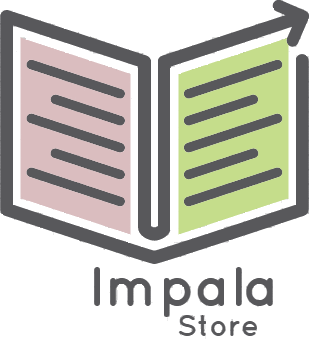

A [Visual FoxPro](https://en.wikipedia.org/wiki/Visual_FoxPro) *(veery old tech)* application that I've developed at the end of high school in order to obtain my digital skills certificate. 

The documentation and big parts of the implementation are written in Romanian, which was a formal request of the process. 

I found it lost on an old drive account and I've decided to upload it here for archiving reasons, as it is, at least as far as I can remember, the first *kinda* functional app that I've developed.  